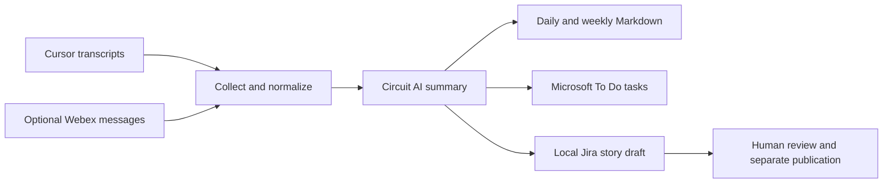

# AutoBrief

**Turn scattered work activity into a reviewable brief and follow-up tasks.**

AutoBrief is a personal workflow automation project that gathers Cursor session activity and optional Webex messages, produces daily and weekly summaries, and routes follow-up work to Microsoft To Do or a local Jira story draft. Its purpose is to make work easier to communicate and follow through on without rebuilding the story from scratch each week.

**Status:** working prototype with service-specific integrations. The public demonstration runs offline with fictional input. Live integrations and summary quality were not revalidated for this portfolio update.

[See the executed sample](demo/output.md) · [Run the demo](#try-it-without-accounts-or-credentials) · [Connected setup](docs/setup.md)

## The workflow



| Problem | What I built | Intended value |
| --- | --- | --- |
| Activity is spread across tools | Configurable transcript and message ingestion | Less manual reconstruction of the work week |
| Technical activity is hard to explain | Daily briefs and weekly narratives | A starting point for stakeholder communication |
| Follow-ups get separated from context | Task creation and pending-task retries | A clearer path from discussion to action |
| Generated stories need review | Local Jira draft output | A review step before publishing work items |

These are design goals, not measured time savings or adoption results. Generated summaries and tasks still need human review.

## My contribution

I owned problem discovery, requirements, workflow design, integration decisions, validation, and iteration. AI assistants helped with brainstorming and writing code. The work I want this project to demonstrate is translating an operational problem into a practical workflow, then making its inputs, outputs, and failure cases inspectable.

This is an independently owned personal project. Provider names describe integrations and do not imply employer sponsorship or endorsement. The repository keeps its original `cursor-digest` URL; the project is called AutoBrief.

## Try it without accounts or credentials

Requires Node.js 20 or newer; the project has no runtime npm dependencies.

```sh
git clone https://github.com/joelgembala/cursor-digest.git
cd cursor-digest
npm ci
npm test
npm run demo
```

The demo copies the actual CLI and libraries into a temporary directory, supplies only fictional transcripts, disables configured services, blocks the adapters' network calls, and writes [the resulting report](demo/output.md). It does not read your Cursor history, load your configuration, create tasks, or install a schedule. Temporary files are removed afterward.

**What this proves:** transcript parsing, the dry-run report path, Markdown output, and the no-input case. **What it does not prove:** AI summary accuracy or successful live integrations. The existing dry-run formatter copies input requests under an “accomplished” heading; that heading is not evidence that the requested work was completed.

## Data and service boundaries

| Path | Behavior |
| --- | --- |
| `npm run demo` | Fictional local input and local report only |
| Connected summarization | Selected transcript excerpts and optional Webex messages go to the configured Circuit endpoint |
| Microsoft To Do | Generated task titles and due dates are sent through Microsoft Graph |
| Jira | The CLI writes a local draft file; a separate review/publication action is needed |
| Scheduled runs | macOS launchd starts the configured jobs on the local machine |

The normal CLI's `--dry-run` is **not an offline switch**: configured Webex spaces may still be read. Use `npm run demo` for the isolated public example. See [setup and limitations](docs/setup.md) before enabling connected operation.

## Decisions and current limits

- Local Markdown reports provide an inspectable output even when downstream task creation fails.
- Failed task creation is queued for retry; this is not a guarantee against every duplicate or partial failure.
- Input windows use transcript file modification times, not a complete event ledger.
- Circuit access is organization-specific, so connected operation is not a universal sign-up-and-run experience.
- macOS schedules depend on the machine being available. OAuth sessions can expire and require reauthorization.
- No benchmark for summary accuracy, time saved, or sustained usage is claimed.

Built with JavaScript/Node.js, JSONL, Markdown, OAuth, Microsoft Graph, Webex, Circuit, and macOS launchd.

[Joel Gembala](https://github.com/joelgembala) · [LinkedIn](https://linkedin.com/in/joelgembala)
